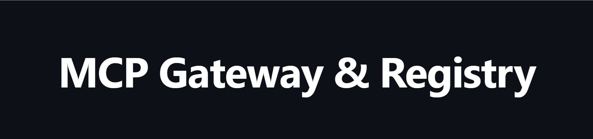

# MCP Gateway & Registry

[Model Context Protocol (MCP)](https://modelcontextprotocol.io/introduction) is an open standard protocol that allows AI Models to connect with external systems, tools, and data sources. While MCP simplifies tool access for Agents and solves data access and internal/external API connectivity challenges, several critical obstacles remain before enterprises can fully realize MCP's promise.

**Discovery & Access Challenges:**
- **Service Discovery**: How do developers find and access approved MCP servers?
- **Governed Access**: How do enterprises provide secure, centralized access to curated MCP servers?
- **Tool Selection**: With hundreds of enterprise MCP servers, how do developers identify the right tools for their specific agents?
- **Dynamic Discovery**: How can agents dynamically find and use new tools for tasks they weren't originally designed for?

The MCP Gateway & Registry solves these challenges by providing a unified platform that combines centralized access control with intelligent tool discovery. The Registry offers both visual and programmatic interfaces for exploring available MCP servers and tools, while the Gateway ensures secure, governed access to all services. This enables developers to programmatically build smarter agents and allows agents to autonomously discover and execute tools beyond their initial capabilities.

| Resource | Link |
|----------|------|
| **Demo Video** | [Amazon Bedrock AgentCore Gateway Integration](https://github.com/user-attachments/assets/6ba9deef-017d-4178-9dd2-257d13fd2c41) |
| **Demo Video** | [Dynamic Tool Discovery and Invocation](https://github.com/user-attachments/assets/cee1847d-ecc1-406b-a83e-ebc80768430d) |
| **Blog Post** | [How the MCP Gateway Centralizes Your AI Model's Tools](https://community.aws/content/2xmhMS0eVnA10kZA0eES46KlyMU/how-the-mcp-gateway-centralizes-your-ai-model-s-tools) |

You can deploy the gateway and registry using Docker Compose on a Google Cloud VM or run it on Cloud Run. Jump to [installation on GCP VM](#installation-on-gcp-vm) or [installation on Cloud Run](#installation-on-cloud-run) for deployment instructions.

## Table of Contents

- [What's New](#whats-new)
- [Architecture](#architecture)
  - [Authentication and Authorization](#authentication-and-authorization)
- [Features](#features)
- [Prerequisites](#prerequisites)
- [Installation](#installation)
  - [Installation on GCP VM](#installation-on-gcp-vm)
    - [Docker Compose Architecture](#docker-compose-architecture)
    - [Quick Start Installation](#quick-start-installation)
    - [Post-Installation](#post-installation)
    - [Running the Gateway over HTTPS](#running-the-gateway-over-https)
  - [Installation on Cloud Run](#installation-on-cloud-run)
- [Using the Gateway and Registry with AI Agents](#using-the-gateway-and-registry-with-ai-agents)
  - [Run Agent with User Identity](#run-agent-with-user-identity)
  - [Run Agent with Its Own Agentic Identity](#run-agent-with-its-own-agentic-identity)
- [Usage](#usage)
  - [Web Interface Usage](#web-interface-usage)
  - [MCP Client Integration](#mcp-client-integration)
    - [Programmatic Access](#programmatic-access)
    - [Integration Example](#integration-example)
  - [Adding New MCP Servers to the Registry](#adding-new-mcp-servers-to-the-registry)
- [Documentation](#documentation)
- [Roadmap](#roadmap)
- [License](#license)

## What's New

* 🚦 **Amazon Bedrock AgentCore Gateway Integration:** Seamless integration with Amazon Bedrock's AgentCore Gateway for enhanced AI agent capabilities and enterprise-grade AWS service connectivity. This integration enables direct access to AWS services through managed MCP endpoints with built-in security, monitoring, and scalability features. See [agents/agent.py](agents/agent.py) for implementation examples.
* **JWT Token Vending Service:** Generate personal access tokens for programmatic access to MCP servers through a user-friendly web interface. Features include scope validation, rate limiting, and secure HMAC-SHA256 token generation. Perfect for automation, scripting, and agent access. [Learn more →](docs/jwt-token-vending.md)
* **Modern React Frontend:** Complete UI overhaul with React 18 + TypeScript, featuring responsive design, dark/light themes, real-time updates, and integrated token management interface.
* **IdP Integration via OAuth2:** Supports both user identity and agent identity modes. See the [Google OAuth setup guide](docs/google-oauth.md) for configuration instructions.
* **Fine-Grained Access Control (FGAC) for MCP servers and tools:** Granular permissions system allowing precise control over which agents can access specific servers and tools. See [detailed FGAC documentation](docs/scopes.md) for scope configuration and access control setup.
* **Integration with [Strands Agents](https://github.com/strands-agents/sdk-python):** Enhanced agent capabilities with the Strands SDK
* **Dynamic tool discovery and invocation:** AI agents can autonomously discover and execute specialized tools beyond their initial capabilities using semantic search with FAISS indexing and sentence transformers. This breakthrough feature enables agents to handle tasks they weren't originally designed for by intelligently matching natural language queries to the most relevant MCP tools across all registered servers. [Learn more about Dynamic Tool Discovery →](docs/dynamic-tool-discovery.md)
* **[Installation on Cloud Run](#installation-on-cloud-run):** Example deployment on Google Cloud Run using container images

## Architecture

The Gateway works by using an [Nginx server](https://docs.nginx.com/nginx/admin-guide/web-server/reverse-proxy/) as a reverse proxy, where each MCP server is handled as a different _path_ and the Nginx reverse proxy sitting between the MCP clients (contained in AI Agents for example) and backend server forwards client requests to appropriate backend servers and returns the responses back to clients. The requested resources are then returned to the client.

The MCP Gateway provides a single endpoint to access multiple MCP servers and the Registry provides discoverability and management functionality for the MCP servers that an enterprise wants to use. An AI Agent written in any framework can connect to multiple MCP servers via this gateway, for example to access two MCP servers one called `weather`,  and another one called `currenttime` and agent would create an MCP client pointing `https://my-mcp-gateway.enterprise.net/weather/` and another one pointing to `https://my-mcp-gateway.enterprise.net/currenttime/`.  **This technique is able to support both SSE and Streamable HTTP transports**. 

```mermaid
flowchart TB
    subgraph Human_Users["Human Users"]
        User1["Human User 1"]
        User2["Human User 2"]
        UserN["Human User N"]
    end

    subgraph AI_Agents["AI Agents"]
        Agent1["AI Agent 1"]
        Agent2["AI Agent 2"]
        Agent3["AI Agent 3"]
        AgentN["AI Agent N"]
    end

    subgraph EC2_Gateway["<b>MCP Gateway & Registry</b> (GCP VM)"]
        subgraph NGINX["NGINX Reverse Proxy"]
            RP["Reverse Proxy Router"]
        end
        
        subgraph AuthRegistry["Authentication & Registry Services"]
            AuthServer["Auth Server<br/>(Dual Auth)"]
            Registry["Registry<br/>Web UI"]
            RegistryMCP["Registry<br/>MCP Server"]
        end
        
        subgraph LocalMCPServers["Local MCP Servers"]
            MCP_Local1["MCP Server 1"]
            MCP_Local2["MCP Server 2"]
        end
    end
    
    %% Identity Provider
    IdP[Identity Provider<br/>Google OAuth]
    
    subgraph EKS_Cluster["GKE/Compute Cluster"]
        MCP_EKS1["MCP Server 3"]
        MCP_EKS2["MCP Server 4"]
    end
    
    subgraph APIGW_Lambda["Amazon API Gateway + AWS Lambda"]
        API_GW["Amazon API Gateway"]
        Lambda1["AWS Lambda Function 1"]
        Lambda2["AWS Lambda Function 2"]
    end
    
    subgraph External_Systems["External Data Sources & APIs"]
        DB1[(Database 1)]
        DB2[(Database 2)]
        API1["External API 1"]
        API2["External API 2"]
        API3["External API 3"]
    end
    
    %% Connections from Human Users
    User1 -->|Web Browser<br>Authentication| IdP
    User2 -->|Web Browser<br>Authentication| IdP
    UserN -->|Web Browser<br>Authentication| IdP
    User1 -->|Web Browser<br>HTTPS| Registry
    User2 -->|Web Browser<br>HTTPS| Registry
    UserN -->|Web Browser<br>HTTPS| Registry
    
    %% Connections from Agents to Gateway
    Agent1 -->|MCP Protocol<br>SSE with Auth| RP
    Agent2 -->|MCP Protocol<br>SSE with Auth| RP
    Agent3 -->|MCP Protocol<br>Streamable HTTP with Auth| RP
    AgentN -->|MCP Protocol<br>Streamable HTTP with Auth| RP
    
    %% Auth flow connections
    RP -->|Auth validation| AuthServer
    AuthServer -.->|Validate credentials| IdP
    Registry -.->|User authentication| IdP
    RP -->|Tool discovery| RegistryMCP
    RP -->|Web UI access| Registry
    
    %% Connections from Gateway to MCP Servers
    RP -->|SSE| MCP_Local1
    RP -->|SSE| MCP_Local2
    RP -->|SSE| MCP_EKS1
    RP -->|SSE| MCP_EKS2
    RP -->|Streamable HTTP| API_GW
    
    %% Connections within API GW + Lambda
    API_GW --> Lambda1
    API_GW --> Lambda2
    
    %% Connections to External Systems
    MCP_Local1 -->|Tool Connection| DB1
    MCP_Local2 -->|Tool Connection| DB2
    MCP_EKS1 -->|Tool Connection| API1
    MCP_EKS2 -->|Tool Connection| API2
    Lambda1 -->|Tool Connection| API3

    %% Style definitions
    classDef user fill:#fff9c4,stroke:#f57f17,stroke-width:2px
    classDef agent fill:#e1f5fe,stroke:#29b6f6,stroke-width:2px
    classDef gateway fill:#e8f5e9,stroke:#66bb6a,stroke-width:2px
    classDef nginx fill:#f3e5f5,stroke:#ab47bc,stroke-width:2px
    classDef mcpServer fill:#fff3e0,stroke:#ffa726,stroke-width:2px
    classDef eks fill:#ede7f6,stroke:#7e57c2,stroke-width:2px
    classDef apiGw fill:#fce4ec,stroke:#ec407a,stroke-width:2px
    classDef lambda fill:#ffebee,stroke:#ef5350,stroke-width:2px
    classDef dataSource fill:#e3f2fd,stroke:#2196f3,stroke-width:2px
    
    %% Apply styles
    class User1,User2,UserN user
    class Agent1,Agent2,Agent3,AgentN agent
    class EC2_Gateway,NGINX gateway
    class RP nginx
    class AuthServer,Registry,RegistryMCP gateway
    class IdP apiGw
    class MCP_Local1,MCP_Local2 mcpServer
    class EKS_Cluster,MCP_EKS1,MCP_EKS2 eks
    class API_GW apiGw
    class Lambda1,Lambda2 lambda
    class DB1,DB2,API1,API2,API3 dataSource
```



### Authentication and Authorization

Authentication and authorization are very key aspects of this solution. The MCP Gateway & Registry supports both:

- **On-behalf-of (User) Flows**: Where AI agents act on behalf of authenticated users using OAuth 2.0 PKCE flow
- **AI Agents with Their Own Identity Flows**: Where agents use their own Machine-to-Machine credentials for autonomous operation

These authentication patterns are discussed in detail in [`docs/auth.md`](docs/auth.md). A Google OAuth setup guide is provided in [`docs/google-oauth.md`](docs/google-oauth.md).

## Amazon Bedrock AgentCore Gateway Integration

Through the MCP Gateway & Registry, you can now connect to an Amazon Bedrock AgentCore Gateway and discover the tools provided by this gateway through the Registry. This integration enables fine-grained access control to the tools and end-to-end authentication overlayed over MCP, providing enterprise-grade security and monitoring capabilities for AI agents accessing AWS services.


## Features

*   **MCP Tool Discovery:** Enables automatic tool discovery by AI Agents and Agent developers. Fetches and displays the list of tools (name, description, schema) based on natural language queries (e.g. _do I have tools to get stock information?_).
*   **Integration with an IdP (Google OAuth, more coming soon):** Secure authentication and authorization through external identity providers for both user identity and agent identity modes.
    *   **JWT Token Vending Service:** Alternative option to test the solution without an external IdP by generating self-signed JWT tokens through the web interface. See [detailed documentation →](docs/jwt-token-vending.md).
*   **Modern React Frontend:** Built with React 18 + TypeScript, featuring:
    *   **Responsive Design:** Modern UI with Tailwind CSS and dark/light theme support
    *   **Real-time Updates:** WebSocket integration for live status updates
    *   **Enhanced UX:** Compact server cards, improved navigation, and accessibility features
    *   **Token Management:** Integrated JWT token generation interface
*   **Service Registration:** Register MCP services via JSON files or the web UI/API.
*   **Web UI:** Manage services, view status, and monitor health through a web interface.
*   **Authentication:** Secure login system for the web UI and API access.
*   **Health Checks:**
    *   Periodic background checks for enabled services (checks `/sse` endpoint).
    *   Manual refresh trigger via UI button or API endpoint.
*   **Real-time UI Updates:** Uses WebSockets to push health status, tool counts, and last-checked times to all connected clients.
*   **Dynamic Nginx Configuration:** Generates an Nginx reverse proxy configuration file (`registry/nginx_mcp_revproxy.conf`) based on registered services and their enabled/disabled state.
*   **Service Management:**
    *   Enable/Disable services directly from the UI.
    *   Edit service details (name, description, URL, tags, etc.).
*   **Filtering & Statistics:** Filter the service list in the UI (All, Enabled, Disabled, Issues) and view basic statistics.
*   **UI Customization:**
    *   Dark/Light theme toggle (persisted in local storage).
    *   Collapsible sidebar (state persisted in local storage).
*   **State Persistence:** Enabled/Disabled state is saved to `registry/server_state.json` (and ignored by Git).

## Prerequisites

*   **Node.js 16+**: Required for building the React frontend. Install from [nodejs.org](https://nodejs.org/)
*   **npm**: Package manager for frontend dependencies (usually comes with Node.js)

*   **GCP Compute Engine VM:** A VM with Docker installed for running this solution via Docker Compose.

*   **Google OAuth Configuration**: Set up OAuth credentials in Google Cloud for authentication. See [docs/google-oauth.md](docs/google-oauth.md) for configuration instructions.

*   **SSL Certificate Options:**
    - **Production Deployments:** SSL certificate is preferred for secure communication to the Gateway
    - **Testing/Development:** Can use localhost when running on a VM, or the VM domain name for testing
    - **Default Configuration:** Gateway is available over HTTP for development

*   **Firewall Configuration:** Configure your VM or Cloud Run service based on your deployment scenario:
    - **HTTPS with SSL certificate:**  Port **8080**, **443** need to be opened
    - **HTTP with domain name:** Port **8080**, **80** need to be opened
    - **HTTP with localhost (port forwarding):** Ports **80**, **7860**, and **8080** need to be opened

*   **External API Keys (Optional):** The Financial Info MCP server requires Polygon API keys for stock ticker data. Configure client-specific API keys using the `.keys.yml` file in the `servers/fininfo` directory. See the [Financial Info Secrets Configuration](servers/fininfo/README_SECRETS.md) for detailed setup instructions.

*   **Authentication Setup:** Configure authentication using Google OAuth as described [here](docs/auth.md). For detailed setup, see the [Google OAuth guide](docs/google-oauth.md). For Fine-Grained Access Control (FGAC) configuration, see the [scopes documentation](docs/scopes.md).

## Installation

### Installation on GCP VM

Deploy the Gateway and Registry on a Compute Engine instance with Docker Compose:

1. **Clone the repository and prepare directories** (see the repository README for directory layout).
2. **Create a `.env` file** from `.env.template` and fill in your Google OAuth credentials.
3. **Install Docker and Docker Compose** on the VM.
4. **Run `./build_and_run.sh`** to build images and start the stack.
5. Access the registry at `http://YOUR_VM_IP:7860` and login via Google OAuth.

#### Post-Installation

Logs can be viewed with `docker-compose logs -f`. SSL certificates can be mounted by placing them under `/home/ubuntu/ssl_data` and running the script with HTTPS enabled.

## Using the Gateway and Registry with AI Agents

### Run Agent with User Identity

1. **Configure environment for user authentication:**
   Copy the template and configure the environment variables:
   
   ```bash
   cp agents/.env.template agents/.env.user
   # Edit agents/.env.user with your Google OAuth configuration
   # See [`docs/google-oauth.md`](docs/google-oauth.md) for detailed setup instructions
   ```

2. **Authenticate with user identity:**
   Run the CLI user authentication script which will prompt you to open a browser window to authenticate with Google OAuth:
   
   ```bash
   python agents/cli_user_auth.py
   ```
   
   This will save a cookie locally in `/home/ubuntu/.mcp` and this cookie will be used when you run the agent.

3. **Run the agent with session cookie:**
   ```bash
   # your_registry_url would typically be http://localhost/mcpgw/sse or https://mymcpgateway.mycorp.com/mcpgw/sse
   python agents/agent.py --use-session-cookie --mcp-registry-url your_registry_url --message "what is the current time in clarksburg, md"
   ```

### Run Agent with Its Own Agentic Identity

1. **Configure environment for agent authentication:**
   Copy the template and configure the environment variables:
   
   ```bash
   cp agents/.env.template agents/.env.agent
   # Edit agents/.env.agent with your Google OAuth configuration
   # See docs/google-oauth.md for detailed setup instructions
   ```

2. **Run the agent with agentic identity:**
   The agent will communicate with Google OAuth to obtain a JWT token which will include information about the groups it is part of. This information is then used by the Auth server for authorization decisions.
   
   ```bash
   # your_registry_url would typically be http://localhost/mcpgw/sse or https://mymcpgateway.mycorp.com/mcpgw/sse
   python agents/agent.py --mcp-registry-url your_registry_url --message "what is the current time in clarksburg, md"
   ```

### Installation on Cloud Run

For a serverless option you can deploy the Docker images to Google Cloud Run. Build the images with `docker-compose build` and push them to Artifact Registry, then create Cloud Run services for the auth server, registry, and Nginx containers. Use the provided `docker-compose.yml` as a reference for environment variables and networking.

## Usage

The MCP Gateway & Registry can be used in multiple ways depending on your needs:

### Web Interface Usage

1.  **Login:** Use the `ADMIN_USER` and `ADMIN_PASSWORD` specified while starting the Gateway container.
2.  **Manage Services:**
    *   Toggle the Enabled/Disabled switch. The Nginx config automatically comments/uncomments the relevant `location` block.
    *   Click "Modify" to edit service details.
    *   Click the refresh icon (🔄) in the card header to manually trigger a health check and tool list update for enabled services.
3.  **View Tools:** Click the tool count icon (🔧) in the card footer to open a modal displaying discovered tools and their schemas for healthy services.
4.  **Filter:** Use the sidebar links to filter the displayed services.

### MCP Client Integration

The MCP Registry provides an API that is also exposed as an MCP server, allowing you to manage the MCP Registry programmatically. Any MCP client that supports remote MCP servers over SSE can connect to the registry.

> **Note:** Using the MCP Gateway with remote clients requires HTTPS. See instructions [here](#running-the-gateway-over-https) for setting up SSL certificates.

#### Programmatic Access

Once connected, your MCP client can:
- Discover available tools through natural language queries
- Register new MCP servers programmatically
- Manage server configurations
- Monitor server health and status

#### Integration Example

**Python MCP Client:**
```python
import mcp
from mcp.client.sse import sse_client

# Connect to the MCP Gateway with authentication
headers = {
    'Authorization': f'Bearer {auth_token}',
    'X-User-Pool-Id': user_pool_id,
    'X-Client-Id': client_id,
    'X-Region': region
}

async with sse_client(server_url, headers=headers) as (read, write):
    async with mcp.ClientSession(read, write) as session:
        # Initialize the connection
        await session.initialize()
        
        # Call a tool with arguments
        result = await session.call_tool(tool_name, arguments=arguments)
        
        # Process the result
        response = ""
        for r in result.content:
            response += r.text + "\n"
```

### Adding New MCP Servers to the Registry

**Option 1 - Via MCP Registry UI:**
Click the "Register Server" button on the top right corner of the Registry web interface and follow the instructions. You'll need to provide the following parameters:

- **Server Name**: Display name for the server
- **Path**: Unique URL path prefix for the server (e.g., '/my-service'). Must start with '/'
- **Proxy Pass URL**: The internal or external URL where the MCP server is running (e.g., 'http://localhost:8001')
- **Description**: Description of the server (optional)
- **Tags**: List of tags for categorization (optional)
- **Number of Tools**: Number of tools provided by the server (optional)
- **Number of Stars**: Rating for the server (optional)
- **Is Python**: Whether the server is implemented in Python (optional)
- **License**: License information for the server (optional)

**Option 2 - Via MCP Host:**
_Coming soon_ - Use MCP Host applications such as VSCode-insiders or Cursor to register servers directly through their MCP client interfaces.

## Documentation

For comprehensive information about using the MCP Gateway & Registry, see our detailed documentation:

- **[Frequently Asked Questions (FAQ)](docs/FAQ.md)** - Common questions and answers for developers and platform engineers
- **[Authentication Guide](docs/auth.md)** - Detailed authentication and authorization patterns
- **[Google OAuth Setup Guide](docs/google-oauth.md)** - Step-by-step Google OAuth configuration
- **[JWT Token Vending Service](docs/jwt-token-vending.md)** - Generate personal access tokens for programmatic access to MCP servers
- **[Fine-Grained Access Control](docs/scopes.md)** - Scope configuration and access control setup
- **[Dynamic Tool Discovery](docs/dynamic-tool-discovery.md)** - AI agent autonomous tool discovery capabilities

## Roadmap

The following GitHub issues represent our current development roadmap and planned features:

### 🚀 Major Features

- **[#37 - Multi-Level Registry Support](https://github.com/agentic-community/mcp-gateway-registry/issues/37)**
  Add support for federated registries that can connect to other registries, enabling hierarchical MCP infrastructure with cross-IdP authentication.

- **[#38 - Usage Metrics and Analytics System](https://github.com/agentic-community/mcp-gateway-registry/issues/38)**
  Implement comprehensive usage tracking across user and agent identities, with metrics emission from auth server, registry, and intelligent tool finder.

- **[#39 - Tool Popularity Scoring and Rating System](https://github.com/agentic-community/mcp-gateway-registry/issues/39)**
  Enhance tool discovery with popularity scores and star ratings based on usage patterns and agent feedback. *Depends on #38.*

### 🔐 Authentication & Identity

- **[#18 - Add Token Vending Capability to Auth Server](https://github.com/agentic-community/mcp-gateway-registry/issues/18)**
  Extend the auth server to provide token vending capabilities for enhanced authentication workflows.

- **[#5 - Add Support for KeyCloak as IdP Provider](https://github.com/agentic-community/mcp-gateway-registry/issues/5)**
  Add KeyCloak integration as an alternative Identity Provider alongside Google OAuth.

### 📋 View All Issues

For the complete list of open issues, feature requests, and bug reports, visit our [GitHub Issues page](https://github.com/agentic-community/mcp-gateway-registry/issues).

## License

This project is licensed under the Apache-2.0 License.
