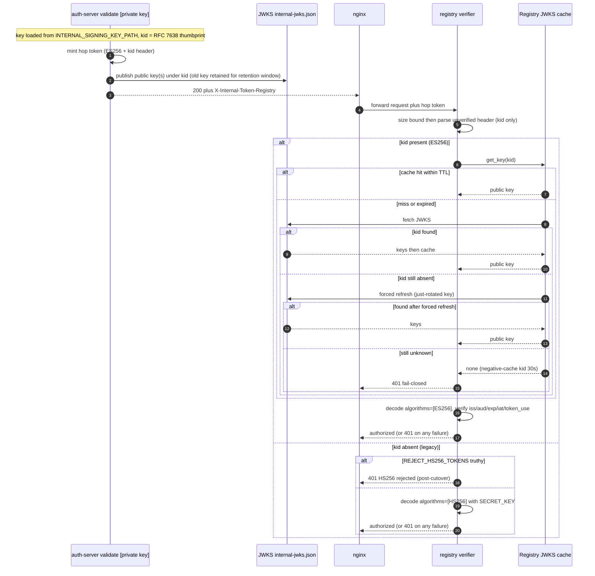

# Asymmetric Signing of Internal Hop Tokens (ES256 + JWKS)

*How the auth-server proves that an internal hop token specifically came from
`/validate`, not merely from some holder of `SECRET_KEY`.*

## Related documentation

- [Internal Hop Authentication](internal-hop-authentication.md) - the signed
  inter-component token design this feature hardens
- [Authentication and Authorization Design](authentication-design.md) - how the
  *external* caller is authenticated
- [Unified parameter reference](../unified-parameter-reference.md) - the full
  Docker / Terraform / Helm mapping of the env vars named here

---

## 100 level: Why asymmetric signing

The internal hop tokens (`X-Internal-Token` for `/mcp-proxy`,
`X-Internal-Token-Registry` for the registry `/api/` hop) were originally signed
with **HS256** using the shared `SECRET_KEY`. HMAC is symmetric: the same key
both signs and verifies. That proves a token "came from *a holder of*
`SECRET_KEY`" - but the registry, the auth-server, and every other component
that has to *verify* a token also *holds* the key. A leaked `SECRET_KEY` (from a
compromised registry, a backup, a log, an env dump) lets an attacker **forge**
hop tokens and impersonate any user across the internal trust boundary.

**ES256 asymmetric signing** closes that gap. The auth-server's `/validate` -
the one component that actually authenticates the caller - holds an **EC P-256
private key** and is the only thing that can *sign*. Every other component
verifies with the **public** half, which it fetches from a JWKS endpoint. A
verifier that only ever sees the public key can never mint a token, so leaking a
verifier's state no longer lets an attacker forge identity.

In one sentence: **only `/validate` can sign internal tokens; everyone else can
only check them.**

This is a hardening of the existing [internal hop
authentication](internal-hop-authentication.md) design, not a replacement - the
audiences, fail-closed behavior, TTLs, and header-ignoring rules are unchanged.

---

## 200 level: Key management, JWKS, and verification

### Key source and file mount

The auth-server loads its signing key from a **file-mounted PEM private key**:

| Setting | Value |
|---------|-------|
| Default mount path | `/etc/mcp-gateway/signing-key/key.pem` |
| Override env var | `INTERNAL_SIGNING_KEY_PATH` |
| Key type | EC P-256 (ES256) private key, PEM-encoded |

On Kubernetes the key is a Secret volume-mounted at the default path; in
docker-compose it is a bind mount. If no key is present (and dev-only
`INTERNAL_SIGNING_KEY_GENERATE=true` is not set), asymmetric signing is disabled
and the auth-server **falls back to HS256** with `SECRET_KEY` - the legacy path.
This is the zero-breaking default (see below).

### The `kid` is the key's RFC 7638 thumbprint

There is **no operator-set key ID**. The `kid` stamped into every ES256 JWT
header is the **RFC 7638 JWK thumbprint** of the public key: the base64url
SHA-256 of the JWK's required members (`crv`, `kty`, `x`, `y`) serialized as
compact JSON with keys in lexicographic order.

This matters for two operational reasons:

1. **Deterministic across replicas.** Every auth-server replica that loads the
   *same* physical key derives the *identical* `kid` with no shared counter or
   coordination. Two replicas can never disagree on a key's id.
2. **Collision-free across rotations.** The thumbprint is a function of the key
   material, so a new key always gets a new `kid` and a `kid` is never reused for
   a different key. Rotation and multi-replica overlap can never collide two keys
   onto one id.

### Live rotation via mtime reload

The auth-server periodically re-`stat`s the key file and reloads it when the
**mtime changes**, with no restart. On rotation:

- the new key is added under its new (thumbprint) `kid`;
- the **old key is retained** in the in-memory key set and in the published JWKS
  for a **retention window**, so tokens minted just before the swap still verify.

The retention window is coupled to the longest possible token lifetime. The
operator-configurable maximum access-token TTL is `MCP_TOKEN_MAX_TTL_HOURS`
(default 24h, hard-capped at 168h by the registry settings clamp). Retention
defaults to **that ceiling + 1h of overlap**, so raising the token cap
automatically keeps the JWKS retention ahead of it. An explicit
`INTERNAL_SIGNING_KEY_RETENTION_SECONDS` can override it. Dropping a key from the
JWKS while a token it signed is still valid would 401 that token, so retention
must always exceed the maximum TTL - hence the coupling.

### JWKS publication

The auth-server publishes its public key(s) as a standard JWKS document at:

```
GET /.well-known/internal-jwks.json
```

The document is **non-sensitive** (public keys only) and is served without
authentication. During a rotation window it contains **both** the new and the
retained old public key, each under its thumbprint `kid`.

### Registry-side fetch and cache

The verifiers in `registry/auth/proxied_token.py` need the public keys. The
registry fetches the JWKS from `internal_jwks_url`
(default `http://auth-server:8888/.well-known/internal-jwks.json`) over the
in-cluster network and caches it. The cache (`registry/auth/internal_jwks.py`) is
synchronous (the verifiers run on the request path) and defends against several
failure and abuse modes:

| Behavior | Mechanism |
|----------|-----------|
| **TTL cache** | Keys are served from cache within `internal_jwks_cache_ttl_seconds`; a miss/expiry triggers a fetch. |
| **Forced refresh on unknown kid** | If a `kid` is still absent after a normal refresh, one *forced* refresh runs (a just-published rotation the previous fetch missed). |
| **Last-known-good** | If a fetch fails, the last successfully fetched keys are served up to a 24h max-staleness bound, then abandoned so a stale key can't be trusted forever. |
| **Unknown-kid negative cache** | A `kid` confirmed absent by a forced refresh is remembered as unknown for 30s (bounded to 4096 entries), so a stream of random/forged `kid` headers can't amplify into repeated network fetches. |
| **Empty-JWKS guard** | An empty/garbled JWKS response does **not** clobber the good cache. |

### Algorithm-confusion defenses

Mixing HS256 and ES256 verification is exactly where JWT "algorithm confusion"
attacks live (e.g. handing an RS/ES public key to an HMAC verifier as its
secret). The registry verifier is written to be immune:

- **`kid` dispatch happens before any decode.** The unverified header is parsed
  only to read `kid`; the algorithm is chosen from `kid` presence, never from an
  attacker-controlled `alg` field.
- **A header that will not even parse is a hard 401** - it never falls through to
  the HS256 path (that fall-through idiom is how confusion slips in).
- **Single-element `algorithms` list.** ES256 decode passes
  `algorithms=["ES256"]`; HS256 decode passes `algorithms=["HS256"]`. Neither
  verifier will ever accept the other algorithm.
- **Issuer-first / full claim checks.** Every decode enforces signature, `exp`,
  `iat`, `iss` (`mcp-auth-server`), and `aud`, plus a `token_use` claim.
- **Size bound.** The raw token is rejected with 401 above 8192 bytes before the
  untrusted header is touched.
- **Fail-closed.** An unknown `kid`, an unavailable JWKS, or any verification
  failure is a 401 - never a silent pass.

### The dispatch, precisely

| Token header | Verification |
|--------------|--------------|
| `kid` **present** | ES256, public key looked up by `kid` in the auth-server internal JWKS (fetched/cached). Unknown `kid` or JWKS unavailable -> 401. |
| `kid` **absent** | HS256 with `SECRET_KEY` (legacy) - **unless** `REJECT_HS256_TOKENS` is truthy, in which case it is hard-rejected with 401. |

The auth-server minter (`auth_server/self_signed_token.py`) and the registry
verifier (`registry/auth/proxied_token.py`) parse `REJECT_HS256_TOKENS` with the
**identical** truthy set (`1`, `true`, `yes`, `on`) so the two sides can never
drift.

---

## 300 level: The verification flow



The fail-closed branches (unknown `kid`, JWKS unavailable, any verification
failure, HS256 rejected post-cutover) all return 401 before any downstream work.

---

## The HS256 -> ES256 cutover

The migration is a two-phase, zero-downtime cutover gated by
`REJECT_HS256_TOKENS`:

1. **Dual-verify (default).** Mount the signing key on the auth-server. It begins
   stamping `kid` and signing ES256; the registry verifies ES256 for tokens that
   carry a `kid` and still accepts legacy HS256 tokens (no `kid`). Rollouts of the
   auth-server and registry can proceed independently - during the window either
   token type verifies.
2. **Close the window.** Once every component is minting ES256 (allow at least one
   maximum-TTL window so no in-flight HS256 token remains), set
   `REJECT_HS256_TOKENS=true` on **both the auth-server and the registry**. The
   minter stops accepting HS256 verification and the registry verifier
   hard-rejects any token without a `kid`. This closes the residual forgery window
   in which a leaked `SECRET_KEY` could still mint an accepted HS256 token.

`REJECT_HS256_TOKENS` **must be set on both services** - it is read by the
auth-server (minter) *and* the registry (verifier). Setting it only on the
auth-server leaves the registry still accepting forged HS256 tokens, which is the
exact window the cutover is meant to close.

## Zero-breaking default

With nothing configured, behavior is **identical to today**:

- No key file mounted -> `INTERNAL_SIGNING_KEY_PATH` unset -> auth-server signs
  **HS256** with `SECRET_KEY`, exactly as before.
- Tokens carry no `kid`, so the registry never consults the JWKS cache and takes
  the HS256 legacy path.
- `REJECT_HS256_TOKENS` defaults to `false`, so legacy tokens are accepted.

An unconfigured deploy is unchanged. Asymmetric signing only activates when an
operator mounts a key, and the HS256 window only closes when an operator flips
`REJECT_HS256_TOKENS` on both services.

## Configuration reference

| Env var | Service(s) | Default | Purpose |
|---------|-----------|---------|---------|
| `INTERNAL_SIGNING_KEY_PATH` | auth-server | `/etc/mcp-gateway/signing-key/key.pem` | Path to the ES256 PEM private key. Set = sign ES256; unset/absent = HS256 fallback. |
| `INTERNAL_SIGNING_KEY_RETENTION_SECONDS` | auth-server | `MCP_TOKEN_MAX_TTL_HOURS` + 1h | How long a rotated-out key stays in the JWKS. |
| `MCP_TOKEN_MAX_TTL_HOURS` | registry | 24 (cap 168) | Longest access-token TTL; drives the default JWKS retention. |
| `REJECT_HS256_TOKENS` | auth-server **and** registry | `false` | Hard-reject legacy HS256 (no-`kid`) tokens. Set on both after the cutover. Truthy: `1`/`true`/`yes`/`on`. |

There is **no** operator-set key-id env var: the `kid` is always the key's RFC
7638 thumbprint.

See [docs/unified-parameter-reference.md](../unified-parameter-reference.md) for
the full Docker / Terraform / Helm mapping of these parameters.
