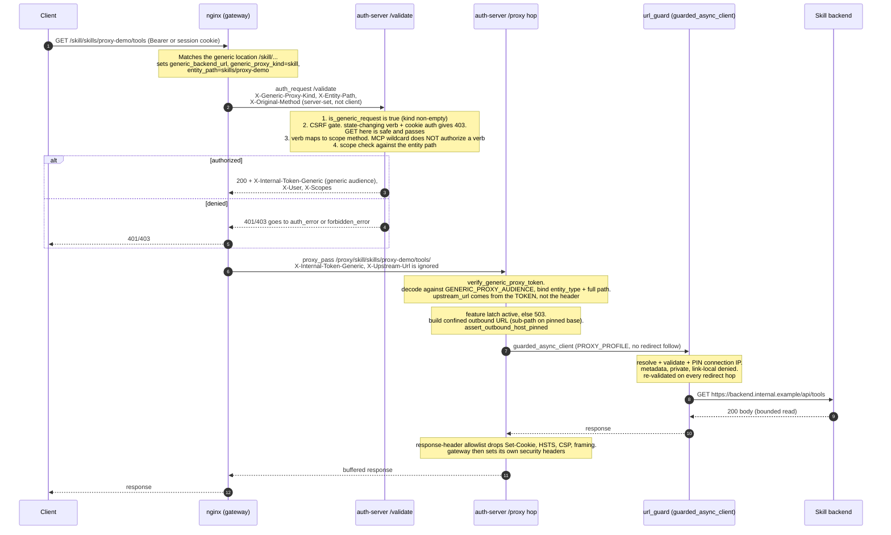
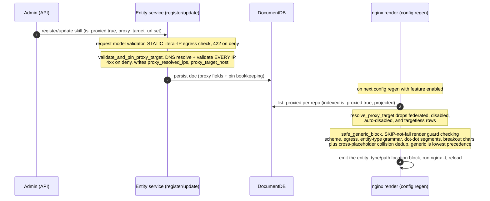

# Gateway Generic Proxy — Design

Status: Foundation landed dark (PR #1628, stack for #1565). Feature is off by
default and a no-op in production until a later slice flips the flags.

Related design docs: [egress-auth-design.md](egress-auth-design.md),
[internal-hop-authentication.md](internal-hop-authentication.md),
[virtual-mcp-server.md](virtual-mcp-server.md),
[storage-architecture-mongodb-documentdb.md](storage-architecture-mongodb-documentdb.md).

## Problem

Today the gateway can reverse-proxy only two entity types: MCP servers (at
`/mcp-proxy/...`) and A2A agents (at `/agent/...`). Every other registry
entity — skills, custom entities, and agents that want a uniform hop — has no
gateway-fronted route, so a client must reach it directly. That defeats the point
of a gateway: one authenticated ingress, one audit point, one egress policy.

This feature lets **any** entity opt into being served through the gateway by
setting `is_proxied=true` and (where it has no native backend) a
`proxy_target_url`. The registry then renders an nginx location block that routes
authenticated traffic through a single uniform auth-server hop to the entity's
backend, with SSRF defense in depth at every layer.

## Scope and non-goals

- **In scope for the generic hop:** `a2a_agent`, `skill`, `custom`.
- **Unchanged:** MCP servers keep their legacy `/mcp-proxy/...` route; existing
  agent routes keep `/agent/...`. Nothing existing is relocated.
- **Alias-only:** virtual servers never emit a generic block.
- **Ships dark:** `gateway_generic_proxy_enabled`,
  `gateway_canonical_namespace_enabled`, `gateway_proxy_allow_private_targets`
  all default `false`. With the feature off, no location block renders, `/validate`
  mints no generic token, and the render path issues **zero** additional per-tick
  DB queries.

## Path model — what changes and what does not

`/proxy/{entity_type}/{path}/` is the **internal** auth-server endpoint nginx
forwards to; a client never calls it. The client-facing location is
`/{entity_type}/{path}`.

| Entity | Route today | After this feature (when enabled) |
|---|---|---|
| MCP server | `/mcp-proxy/...` | unchanged |
| A2A agent (existing) | `/agent/...` | unchanged |
| A2A agent (opted-in) | — | additional `/a2a_agent/...` generic route |
| Skill / custom (opted-in) | not proxyable | new `/skill/...`, `/{custom-type}/...` |
| Virtual server | alias-only | alias-only (no generic block) |

`gateway_canonical_namespace_enabled` is defined but read nowhere in this
foundation PR — a dormant placeholder. Its intent (per its config docstring) is a
later slice that emits canonical `/entity_type/path` blocks **alongside** the
legacy flat aliases (additive, including for MCP servers), gated until the matching
`/validate` entity-derivation and canonical-alias minting land.

---

## DocumentDB / MongoDB changes

This is the only storage-facing part of the feature, and it is deliberately small.
There is **no schema migration and no backfill**.

### 1. New persisted fields (the `ProxyableMixin`)

`registry/schemas/proxy_mixin.py` defines `ProxyableMixin`, mixed into the five
storage models (server, agent, skill, virtual server, custom entity) and their
request/patch models. These fields therefore become part of each entity document:

| Field | Type | Written by | Meaning |
|---|---|---|---|
| `is_proxied` | `bool` (default `false`) | admin opt-in (API) | when true, the entity gets a gateway route |
| `proxy_target_url` | `str \| None` | admin (API) | backend the gateway forwards to; required for skills/custom (they have no native backend URL) |
| `proxy_resolved_ips` | `list[str]` | resolve-and-validate refresh | IPs the hostname last resolved to (egress re-validation bookkeeping) |
| `proxy_target_host` | `str \| None` | refresh | original hostname preserved for Host/SNI |
| `proxy_disabled_reason` | `str \| None` | refresh | set when the refresh auto-disables a route (e.g. target now resolves to a denied IP); when non-null the entity is treated as NOT proxied |

Because every field has a default, this is a **purely additive, backward-compatible
schema change**. Existing documents simply lack the keys; `is_proxied` reads as its
default (`false`), so a legacy row is "not proxied" with no migration step. A
document is never rejected on read for a missing or even a bad proxy value — see
the read-safety note below.

### 2. New index — `idx_is_proxied`

`registry/repositories/documentdb/_identity_url_sidecar.py` adds
`ensure_is_proxied_index(collection, name)`, called from each DocumentDB
repository's `ensure_indexes()` (server, agent, skill, custom, virtual):

- **Preferred:** a *partial* index
  `create_index("is_proxied", partialFilterExpression={"is_proxied": True})` so
  only the (few) proxied documents are indexed.
- **Fallback:** AWS DocumentDB may reject `partialFilterExpression`, so on failure
  it creates a plain single-field index `idx_is_proxied_plain`. The
  `{"is_proxied": True}` query uses either.
- **Never raises.** If both fail, `list_proxied` still works via an unindexed scan —
  the index is an optimization, not a correctness requirement. Crucially it runs
  *after* `_indexes_created` is set, so an index failure can't leave that guard
  `False` and re-run every index on every op.

### 3. New query — `list_proxied()`

Each DocumentDB repository gets `list_proxied()` (the base interface returns `[]`,
so non-DocumentDB backends are a safe no-op). It is a **projected** query returning
raw dicts, not reconstructed model objects:

```python
projection = {
    "is_proxied": 1, "is_enabled": 1, "proxy_target_url": 1,
    "proxy_resolved_ips": 1, "proxy_target_host": 1,
    "proxy_disabled_reason": 1, "sync_metadata": 1,
}
cursor = collection.find({"is_proxied": True}, projection)  # then _id -> "path"
```

Two deliberate properties:
- **Projection, not full doc:** only the columns the nginx render +
  `resolve_proxy_target` need, keeping the render hot path cheap.
- **Raw dicts, not model reconstruction:** a bypass-written invalid row (federation
  raw write, migration, manual edit) cannot crash the nginx reload by throwing
  during Pydantic reconstruction. On any error the method logs and returns `[]`
  (fail-closed to "nothing to render").

### 4. Zero queries while disabled

`_fetch_generic_proxied_resources()` (the render-time collector) early-returns `[]`
when `gateway_generic_proxy_enabled` is false, **before** touching any repository.
An upgraded-but-not-enabled deployment pays no new per-tick fan-out. There is a test
asserting zero new DB queries in the disabled state.

### Storage read-safety (why no raising validator on stored docs)

The mixin has **no raising field validator** on `proxy_target_url`. Storage models
are reconstructed from the DB on every read; a raising egress check would make a
denied-but-stored target throw on load, and because listings skip rows that fail to
build, the bad record would silently vanish from every listing — hiding exactly what
an admin needs to fix. So the raising check lives only on the request/patch models
(the API edge, built from client payloads, never from stored data). For stored data
the enforcement is that the render/fetch path simply does not produce a route for a
denied target.

---

## End-to-end request sequence (example: a proxied skill)

Assume a skill registered at path `skills/proxy-demo`, flagged `is_proxied=true`
with `proxy_target_url=https://backend.internal.example/api`, and the feature
enabled. A client calls `GET {ROOT_PATH}/skill/skills/proxy-demo/tools`.



### Reading the shapes

1. **nginx generic location block.** Rendered per proxied entity. It sets
   `$generic_backend_url` (a *separate* variable from the MCP `$backend_url`, so the
   MCP token mint never fires here), `$generic_proxy_kind`, and `$entity_path`, then
   issues the `auth_request /validate` subrequest and forwards the server-set marker
   headers.
2. **`/validate` (the authz brain).** Discriminates the generic hop by the non-empty
   `X-Generic-Proxy-Kind`. Runs the CSRF gate first (a state-changing verb under
   ambient cookie auth is refused with 403 before any token mint; Bearer callers
   exempt; gated by `gateway_generic_require_bearer_for_writes`). Maps the HTTP verb
   to a scope method — the legacy MCP `methods:["*"]` wildcard does **not** authorize
   an HTTP verb (that needs explicit `["GET","HEAD"]` or the distinct `http:*`
   token). On success it mints the generic-audience internal token into
   `X-Internal-Token-Generic`.
   - **Marker-spoof invariant:** the marker headers are trusted only because the
     shared `/validate` block redefines them via `proxy_set_header` from nginx
     variables the location set — never from client headers.
3. **`/proxy/{entity_type}/{entity_path:path}` (the uniform hop).**
   `verify_generic_proxy_token` decodes the token against `GENERIC_PROXY_AUDIENCE`
   and binds both `entity_type` and the full registered path on a segment boundary.
   The destination is taken from the **token claim** `upstream_url`, not the inbound
   `X-Upstream-Url` header (which is ignored). It builds a confined outbound URL
   (sub-path appended to the pinned base) and asserts the host stayed pinned.
4. **Fetch via `guarded_async_client` (PROXY_PROFILE).** Resolves, validates every
   IP, and pins the connection IP inside the transport for the request and each
   redirect. `follow_redirects=False`: a 30x is returned to the client verbatim so
   the next hop re-enters the gateway and is re-authorized. Same egress policy as
   registration time, so decisions can't drift.
5. **Response shaping.** A response-header allowlist drops `Set-Cookie`/HSTS/CSP/
   framing; the gateway sets its own security headers. Body is read bounded
   (`gateway_generic_client_max_body_size` / `gateway_generic_max_concurrency`).

### Failure shapes

- Feature latch off (flag disabled or startup egress self-check failed) → `503`.
- Missing/invalid/wrong-audience token → `401` at the hop.
- Egress blocked at connect time (pinned target resolved to a denied IP) → `502`
  ("Upstream not permitted"), logged by reason only (never the raw target).
- Upstream timeout → `504`; other upstream error → `502`.

---

## How a route comes to exist (registration → render)



The egress policy is enforced at three points on the one canonical `url_guard`:
the API edge (static, 422), the service register/update layer (DNS-aware, 4xx), and
fetch time (pinned transport). A federation sync stripping proxy fields on ingest
and export means peer data can never become a live local route.

---

## Response streaming (SSE / chunked)

A proxied entity may opt into **response streaming** by setting `proxy_streaming=true`
(field on `ProxyableMixin`). The default (`false`) keeps the unary, buffered hop that
reads the whole bounded response before replying. Streaming is for long-lived or
token-streaming backends — e.g. an LLM proxied as a custom type, or an agent SSE
session.

Like every other per-request decision, streaming is **bound into the signed
generic-proxy token**, never trusted from an inbound header. The nginx render sets a
fixed `$generic_streaming "1"` marker on the streaming route; `/validate` forwards it
and mints it into the token; the hop switches to a `StreamingResponse` only when the
SIGNED claim says so. A client cannot force streaming by spoofing a header.

What the streaming route and hop do differently:

- **nginx buffering off.** The streaming location emits `proxy_buffering off` plus
  `proxy_read_timeout {gateway_generic_stream_read_timeout_seconds}s` and
  `proxy_set_header Connection ""`, so SSE/chunked bytes flow to the client
  incrementally instead of being held until complete.
- **Isolated concurrency pool.** Streaming acquires a **separate** semaphore
  (`gateway_generic_stream_max_concurrency`, default 8) from the buffered hop's
  `gateway_generic_max_concurrency`, so a burst of long-lived streams can never
  starve unary requests (or vice versa).
- **Acquire timeout.** Waiting for a stream slot is bounded by
  `gateway_generic_acquire_timeout_seconds` (default 5.0s, floored at 0.1s); exceeding
  it returns `503` rather than queueing unboundedly.
- **Absolute duration ceiling.** `gateway_generic_stream_max_duration_seconds`
  (default 3600s) is an absolute lifetime cap covering client construction, response
  headers, and the complete body. It is enforced with an explicit deadline checked
  before each chunk (`asyncio.wait_for`), so a stream is severed even if it keeps
  dribbling data.
- **Byte cap.** `gateway_generic_stream_max_bytes` (default 100 MiB) hard-caps the raw
  bytes forwarded by one streaming response; exceeding it aborts with `413`.
- **Idle read timeout (time-to-first-byte and inter-chunk).**
  `gateway_generic_stream_read_timeout_seconds` (default 3600s) bounds how long the
  hop waits for the response headers AND between chunks, applied at the auth-server
  hop as `asyncio.wait_for(anext(...), min(remaining, read_timeout))` on top of the
  absolute duration deadline. It is the SAME knob that drives nginx
  `proxy_read_timeout`, so the hop and nginx agree, and a connect-then-stall upstream
  can no longer pin a stream slot for the full absolute duration. The 1h default is
  loose enough for a slow-first-token LLM; lower it to detect a dead upstream sooner.
  The underlying httpx per-read timeout stays `None` — the idle bound is enforced by
  the explicit `wait_for`, not httpx — so the bound applies uniformly to headers and
  every chunk.
- **Deterministic cleanup.** The httpx client and open response outlive the handler
  (a `StreamingResponse` consumes its body generator after the handler returns), so
  the transport is opened manually and closed — plus the semaphore released — in an
  idempotent cleanup run from a `BackgroundTask` and the generator's `finally`, so a
  client disconnect or a limit breach mid-stream never leaks a stream slot.
- **Same egress guards.** Streaming still uses `guarded_async_client` (PROXY_PROFILE,
  `follow_redirects=False`, IP-pinned), the response-header allowlist, and the
  gateway's own security headers — identical to the buffered path. A connect-time
  egress block is a `502`, a duration/setup timeout a `504`.

> **Operator note — long-lived agent SSE beyond 1h.** Both the absolute duration
> ceiling and the nginx read timeout default to 3600s (1h). To proxy an SSE session
> that must stay open longer, raise **both**
> `GATEWAY_GENERIC_STREAM_MAX_DURATION_SECONDS` **and**
> `GATEWAY_GENERIC_STREAM_READ_TIMEOUT_SECONDS` together — raising only one still
> severs the stream at the lower of the two (nginx or the hop's idle read timeout
> closes a quiet upstream, or the hop's absolute deadline fires).

Implementation: `_generic_proxy_streaming` in `auth_server/server.py`;
`_create_generic_proxy_block` streaming variant in `registry/core/nginx_service.py`.

---

## Static upstream auth headers

A proxied entity can carry **operator-configured static upstream auth headers** —
e.g. a fixed API key for an LLM or SaaS backend proxied as a custom type — presented
by the gateway on the egress hop. This is operator-scoped (the same value for every
caller), distinct from the per-user egress vault described in
[egress-auth-design.md](egress-auth-design.md); the two can coexist.

- **Stored encrypted, never surfaced.** Values are accepted on create/update via a
  plaintext `custom_headers` list and stored as `{name, value_encrypted}` on
  `custom_headers_encrypted` (`ProxyableMixin`) using a `SECRET_KEY`-derived Fernet
  (`registry/utils/credential_encryption.py`). Plaintext values are NEVER serialized
  to API consumers, rendered into nginx, or logged. Reads expose only
  `custom_header_names` / `custom_header_overridable_names`. The nginx render only ever
  sets a fixed `$generic_has_upstream_auth "1"` marker (bound into the token) — the
  secret never enters the config.
- **Vended over an internal listener at request time.** When the token's
  `has_upstream_auth` claim is set, the hop fetches the decrypted headers from the
  registry's internal vend endpoint `/internal/generic-upstream-headers`, reached over
  the dedicated internal nginx listener on **port 8091** at
  `/_egress_internal/generic-upstream-headers` and gated by a fresh internal service
  token (`validate_internal_auth`). This is the same trust boundary as the egress
  vault; the plaintext values leave the registry only over this hop.
- **Vend-time canonical-URL cross-check.** The vend re-verifies the forwarded
  `X-Internal-Token-Generic`, takes the entity identity and pinned upstream from the
  **signed claims (not the request body)**, and cross-checks the token's `upstream_url`
  against the entity's registered effective target on the **full canonical URL**
  (`normalize_url_identity`: scheme, host, effective port, path, query — not just
  origin). Credentials registered for `/v1` or one tenant query are never vended to
  `/v2` or another tenant on the same host, and a forged upstream marker cannot vend
  headers for an attacker-chosen host.
- **Reserved-name denylist.** Names in `RESERVED_CUSTOM_HEADER_NAMES`
  (`registry/constants.py`) — hop-by-hop/framing headers, ingress credentials, and the
  gateway-internal identity/routing/signed-token family (`x-user`, `x-internal-token*`,
  `x-generic-*`, `x-resolved-*`, …) — are rejected at registration and stripped at the
  hop, so a registrant can never make the gateway forward its own identity or signed
  token to a registrant-controlled backend. `Authorization` is the sole reserved name
  permitted (see caller passthrough).
- **Fail-closed vend.** Missing, inactive, targetless, federated, mismatched, or
  undecryptable entities return a non-2xx; an empty 200 is reserved for a live entity
  with genuinely no credential headers. Credential headers additionally require an
  **HTTPS** target (checked on storage presence, before decryption). A `None` result at
  the hop is fatal — the request is refused rather than forwarded unauthenticated.
- **Repoint clears the credential.** An update that repoints the target
  (`clear_upstream_headers_on_repoint`) clears the stored encrypted headers, so a
  credential minted for one destination cannot follow the route to a new one.

Vend: `vend_generic_upstream_headers` in `registry/api/egress_auth_routes.py`;
injection: `_fetch_generic_upstream_headers` + `_merge_generic_upstream_headers` in
`auth_server/server.py`.

## Caller header passthrough (overridable slots)

Each static header may instead be marked **`overridable`**. This is the **second
sanctioned exception** to the gateway's "client auth headers are ingress-only" rule
(the first being the internal `airegistry-tools` relay — see
[egress-auth-design.md](egress-auth-design.md)). An overridable name is the granular
unit of caller passthrough on the generic hop, and lands in one of three shapes:

| Shape | Registered | Overridable | Stored value | Egress behavior |
|---|---|---|---|---|
| Fixed operator credential | yes | no | yes | Operator value is authoritative; overwrites any caller copy |
| Operator default, caller may override | yes | yes | yes | Operator default injected unless the caller sends the same name, in which case the caller's value wins |
| Caller-only slot | yes | yes | no | Nothing injected by default; forwarded only if the caller sends it |

`_merge_generic_upstream_headers` re-admits a caller-supplied header **only if its name
is in the entity's vended `overridable_names` allowlist** (`custom_header_overridable_names`).
Every other caller header outside the small protocol baseline
(`_FORWARDED_GENERIC_REQUEST_HEADERS`: `accept`, `content-type`, `range`, conditional
headers, …) is dropped. The allowlist is names-only — never a value — and reserved
names can never appear in it.

**The Authorization slot and its equal-token guard.** An operator may opt an
`Authorization` passthrough slot in (the one reserved name allowed). Because the gateway
credential is itself a bearer, this slot is guarded by
`_assert_generic_authorization_not_gateway_cred` — the generic-hop parity of the A2A
equal-token check — which `401`s if the outbound `Authorization` equals the caller's
gateway credential (compared by bearer VALUE, catching duplicates that differ only by
scheme/whitespace). The caller therefore MUST send the **gateway credential in
`X-Authorization`** and the **backend token in `Authorization`**; if both carry the same
bearer the request is refused, fail-closed, so a caller can never make the gateway
forward its own credential to a registrant-controlled backend for replay against the
gateway.

---

## Configuration (all fail-closed)

| Setting | Default | Purpose |
|---|---|---|
| `gateway_generic_proxy_enabled` | `false` | master switch; gates render fetch + hop |
| `gateway_canonical_namespace_enabled` | `false` | dormant placeholder (future canonical aliases) |
| `gateway_proxy_allow_private_targets` | `false` | relax loopback/private/CGNAT only (metadata never overridable) |
| `gateway_generic_require_bearer_for_writes` | `true` | refuse state-changing verbs under ambient cookie auth |
| `gateway_generic_client_max_body_size` | `1m` | inbound body cap (strict nginx size-token validator) |
| `gateway_generic_max_concurrency` | (set) | in-flight cap on the buffered hop |
| `gateway_generic_stream_max_concurrency` | `8` | isolated in-flight cap for the streaming hop (a separate pool from the buffered one, so long-lived streams cannot starve unary requests) |
| `gateway_generic_acquire_timeout_seconds` | `5.0` | max wait to acquire either concurrency slot before `503` (floored at 0.1s) |
| `gateway_generic_stream_max_duration_seconds` | `3600` | absolute lifetime ceiling for one streaming response (setup + headers + full body); exceeding it aborts the stream |
| `gateway_generic_stream_max_bytes` | `104857600` (100 MiB) | hard byte cap on one streaming response; exceeding it returns/aborts with `413` |
| `gateway_generic_stream_read_timeout_seconds` | `3600` | Idle read bound at the auth-server hop (time-to-first-byte + inter-chunk) AND nginx `proxy_read_timeout` on the streaming route; see streaming section |
| `gateway_generic_tls_verify` | (set) | upstream TLS verification mode |
| `gateway_egress_selfcheck_enabled` | (set) | probe metadata IPs at startup; disable feature if egress not enforced |

## Observability

- `mcpgw_registry_gateway_generic_blocks_dropped_total{reason=invalid|collision}` —
  counts render-time drops.
- `gateway_egress_policy_unverified` — gauge set to 1 when the startup egress
  self-check found metadata reachable (feature latched off for the process).
