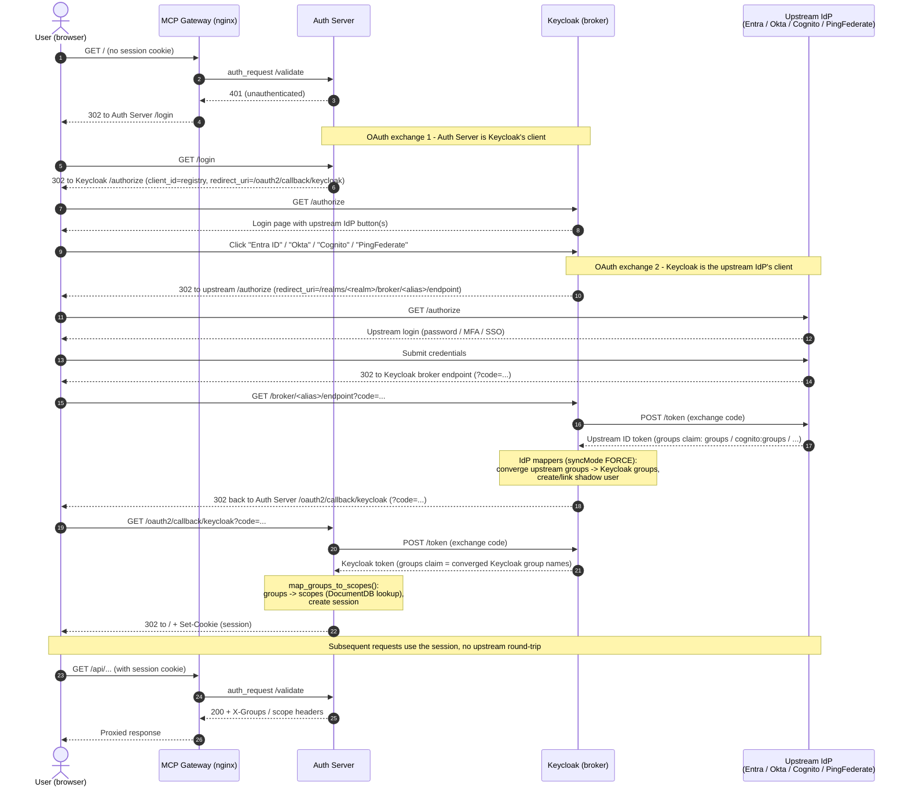

# Keycloak Identity Brokering (Multi-Tenant Federation)

This guide explains how to let users from **different upstream identity providers** — for example Tenant A on Okta and Tenant B on Microsoft Entra ID — log in to the same MCP Gateway & Registry deployment **simultaneously**, using Keycloak as an **identity broker**.

It is organized in three parts:

1. [Concept](#1-concept-what-identity-brokering-is-and-why-it-fits) — what brokering is, why the registry is already built for it, and the two-stage model.
2. [What to do in Keycloak](#2-what-to-do-in-keycloak) — the concrete, step-by-step configuration, with a fully worked Entra ID example.
3. [Mapping brokered groups to registry access](#3-mapping-brokered-groups-to-registry-access) — how a brokered user ends up seeing (and invoking) MCP servers.

Whether and to what extent this gets baked into the Helm charts / Terraform is deliberately treated as a **separate, later decision** — see [Automation: what could be codified](#4-automation-what-could-be-codified-later).

> **Terminology.** Throughout this doc, "**broker**" is the Keycloak realm your gateway trusts. "**Upstream IdP**" (or "identity provider") is the external system where a tenant's users actually live (Entra, Okta, Auth0, another Keycloak, ...). "**Brokered user**" is the shadow user Keycloak creates locally to represent an upstream user.

---

## 1. Concept: what identity brokering is, and why it fits

### 1.1 The requirement

> Tenant A has its own IdP. Tenant B has its own IdP. We want both to work at the same time against the same gateway.

The clean way to satisfy this is **not** to teach the gateway about every tenant's IdP. It is to put **one** thing in the middle that the gateway trusts — Keycloak — and let Keycloak federate outward to each tenant's IdP:

```
Tenant A user ──▶ Okta         ┐
                               ├──▶ Keycloak (broker) ──▶ MCP Gateway / Registry
Tenant B user ──▶ Entra ID     ┘        (the single issuer your gateway trusts)
```

The user authenticates at **their own** IdP. Keycloak receives that assertion, brokers it into a Keycloak session, and mints a **Keycloak token**. The gateway validates only the Keycloak token — it never has to know or trust each tenant's IdP directly. The user's home identity still lives in Entra/Okta; Keycloak keeps a lightweight "shadow" user linked to the upstream account.

This is exactly the phrase people use to describe it: *"you log in to Keycloak, but the actual user exists in Entra."*

### 1.2 Why the registry is already built for this

The registry's authorization is **IdP-agnostic by design.** At the point where access is decided, all it sees is a Keycloak token with a `groups` claim — a plain list of strings. It does not know or care whether a given group originated in Entra, Okta, or a native Keycloak group.

Concretely, the token-handling path (`auth_server/providers/keycloak.py`) reads:

```python
"groups": claims.get("groups", []),
```

and the group-to-scope step (`auth_server/server.py:map_groups_to_scopes`) does an exact-string lookup of those group names against the registry's stored `group_mappings`. There is no IdP-specific branching. This is the same groups → scopes → access path used by every provider (see [docs/scopes.md](../scopes.md) and [docs/idp/cognito.md](cognito.md)); only the *claim name* differs per provider (`groups` for Keycloak, `cognito:groups` for Cognito, etc.).

**Consequence:** the entire multi-tenant problem reduces to a single question —

> How do I make Entra groups **and** Okta groups both show up as sensible, consistent strings in Keycloak's `groups` claim?

That is a Keycloak configuration task. It does not require registry code changes.

### 1.3 The two-stage model

```
Entra groups ─┐                              ┌─ groups claim ─┐
              ├─▶ Keycloak IdP mappers ──────┤                ├─▶ group_mappings → scope → server_access
Okta groups  ─┘   (NORMALIZE here, Stage 1)  └─ (uniform)     ┘   (registry, IdP-blind, Stage 2)
```

- **Stage 1 (Keycloak, this guide):** each upstream IdP is added as a Keycloak *Identity Provider*, with *mappers* that translate the upstream group representation into Keycloak groups. This is where Entra and Okta differ, and where you make them converge.
- **Stage 2 (registry, [section 3](#3-mapping-brokered-groups-to-registry-access)):** the converged Keycloak group names are mapped to scopes and server access — the same mechanism used for any IdP.

### 1.3.1 End-to-end login sequence

The diagram below shows one brokered login, with the runtime components involved. The gateway (nginx) and auth-server are the registry's own components; Keycloak is the broker; the upstream IdP (Entra / Okta / Cognito / PingFederate) is where the user actually authenticates. Note the two separate OAuth authorization-code exchanges (auth-server ↔ Keycloak, and Keycloak ↔ upstream IdP) and where each token's group claim is read.



### 1.4 The single hardest detail: groups look different per IdP

The one thing that reliably trips people up is that upstream IdPs emit group membership in **very different shapes**:

| | **Entra ID** | **Okta** | **Amazon Cognito** | **PingFederate** | **Native Keycloak** |
|---|---|---|---|---|---|
| Claim name | `groups` | `groups` | `cognito:groups` | Configurable (default `groups`) | `groups` |
| What the claim contains | **Object IDs (GUIDs)** by default — `"5510a1b0-..."`, not names | Group **names** — `"mcp-admins"` | Group **names** — `"mcp-admins"` | Group **names** or **DNs** — whatever the ATM/OIDC policy emits | Group **path/name** — `"/mcp-admins"` or `"mcp-admins"` |
| How to emit it | App registration → Token configuration → add **groups** claim | Custom `groups` claim on the authorization server with a filter | Automatic — the User Pool always puts group memberships in `cognito:groups` | JWT ATM extended attribute contract + OIDC policy mapping (see [pingfederate.md](pingfederate.md)) | Built-in group-membership mapper |
| Caveat | "Overage": if a user is in > ~150–200 groups, Entra replaces the claim with a Graph API pointer | Filter server-side; no overage | Names must be unique across the pool; no GUIDs | Empty groups if the user store has no group concept (e.g. Simple PCV) | n/a |

If you do nothing, Entra users arrive at Keycloak carrying opaque GUIDs while Okta users arrive with readable names. You do **not** want raw GUIDs leaking into the registry's `group_mappings` — it couples your access config to a tenant's directory and is unmaintainable. Stage 1 is where you fix that.

### 1.5 Two strategies for normalization

**Strategy 1 — converge onto shared Keycloak groups (recommended).**
Add a per-IdP mapper so that both Entra's GUID and Okta's name land in the **same** Keycloak group:

```
Entra group GUID 5510a1b0-...  ─┐
                                ├─▶ Keycloak group /mcp-registry-admin
Okta group "okta-mcp-admins"   ─┘
```

Keycloak then emits `"groups": ["mcp-registry-admin"]` for users from either tenant. The registry sees one clean name. Tenant-specific ugliness (GUIDs, tenant-prefixed names) stays contained inside Keycloak. This also sidesteps the Entra overage problem, because Keycloak only emits the mapped groups, not all of the user's upstream groups.

**Strategy 2 — pass through with a tenant prefix.**
Emit groups verbatim but namespaced per tenant, e.g. `entra:<guid>` and `okta:mcp-admins`. Simpler mapper config, but it pushes tenant-awareness into the registry's `group_mappings` and keeps GUIDs visible. Only worth it if you specifically want the two tenants' groups kept distinct in registry config.

**Use Strategy 1 unless you have a concrete reason to keep tenants' groups separate in the registry.** The rest of this guide uses Strategy 1.

---

## 2. What to do in Keycloak

There are two layers of work, and it is important to keep them straight because they live in **different systems**:

- **2A. Upstream IdP setup** — done in Azure / Okta / etc. (external to your cluster). This is inherently per-tenant and cannot be fully automated by this project; it is documented here as a worked example.
- **2B. Keycloak broker setup** — done in the Keycloak realm the gateway trusts. Identical shape regardless of which upstream IdP; only the values differ.

Both are shown below for **OIDC** (the most common case). Okta and Auth0 can be brokered via OIDC in exactly the same shape; SAML differs only in the provider type and endpoint fields.

### 2A. Upstream IdP setup (worked example: Microsoft Entra ID)

You need an **app registration** in the tenant, and you need it to **emit group membership**. The redirect URI must point back at your Keycloak broker endpoint (see 2B for the exact URL shape).

Steps in the Entra admin center (`entra.microsoft.com`):

1. **App registration.** Identity → Applications → App registrations → New registration.
   - **Redirect URI** (Web): `https://<keycloak-external-host>/realms/<realm>/broker/<alias>/endpoint`
     - `<alias>` is the Keycloak IdP alias you will create in 2B (e.g. `entra-oidc`). It must match exactly.
     - Example (from a live deployment): `https://mcpregistry.example.com/realms/mcp-gateway/broker/entra-oidc/endpoint`
     - Note the path is **root** (`/realms/...`), not `/auth/realms/...`, on modern Keycloak (Quarkus). Confirm your Keycloak's external base URL.
2. **Client secret.** Certificates & secrets → New client secret → copy the **Value** (shown once).
3. **Emit groups.** Token configuration → Add groups claim → choose **Security groups** (or **Groups assigned to the application** to keep the list small and avoid the overage limit). Add it to the **ID token** (and Access token if you also do M2M).
   - By default this emits group **object IDs (GUIDs)**. That is fine — the Keycloak mapper in 2B keys on the GUID. (Emitting names is only reliable for on-prem-synced groups; cloud-only Entra groups are GUID-only.)
4. Collect these four values for 2B:
   - **Directory (tenant) ID**
   - **Application (client) ID**
   - **Client secret** (the Value)
   - The **GUID(s)** of the group(s) you want to grant access (Groups → each group → Object Id).

> **Okta equivalent (brief).** Create an OIDC app (Web), set the sign-in redirect URI to the same `/realms/<realm>/broker/<alias>/endpoint` shape, and add a **groups claim** on the Okta authorization server (Security → API → Authorization Servers → Claims) with a filter (e.g. `Matches regex .*`) so the ID token carries a `groups` array of **names**. Collect the issuer, client ID, and client secret.

> **Amazon Cognito equivalent (brief).** Cognito is a standard OIDC provider, so it brokers exactly like Entra/Okta. In your User Pool, create an **App Client** of type "Traditional Web App" (confidential, **Authorization code grant**, scopes `openid profile email`), and add the same `/realms/<realm>/broker/<alias>/endpoint` URL to the App Client's **Allowed callback URLs**. Cognito automatically emits the user's groups in the **`cognito:groups`** claim (group **names**, not GUIDs) — there is nothing extra to configure to get groups. Collect the **App Client ID** and **client secret**, and note the OIDC discovery URL `https://cognito-idp.<region>.amazonaws.com/<userPoolId>/.well-known/openid-configuration` (issuer `https://cognito-idp.<region>.amazonaws.com/<userPoolId>`) — Keycloak's "Discovery endpoint" field auto-fills the authorization/token/JWKS URLs from it. Assign users to Cognito groups the usual way (see [cognito.md](cognito.md) for the console/CLI steps).

> **PingFederate equivalent (brief).** PingFederate is a full OIDC/SAML IdP and brokers via OIDC the same way. Create an **OAuth client** (Client Secret auth, **Authorization Code** grant, scopes `openid email profile groups`) with the redirect URI set to the same `/realms/<realm>/broker/<alias>/endpoint` shape, and make sure your OIDC policy emits group membership in a claim (default `groups`) via the JWT ATM attribute contract — see the [PingFederate setup guide](pingfederate.md) for the ATM/OIDC-policy steps. Collect the issuer (`https://<pf-host>/.well-known/openid-configuration`), client ID, and client secret. **Note:** unlike the direct-PingFederate path, the registry's `idp_user_groups` fallback does **not** apply here — in the brokered flow, Keycloak only ever sees the token PingFederate issues, so the groups must be present in that upstream token (populate them from your user store, e.g. LDAP `memberOf`).

### 2B. Keycloak broker setup

All of this happens in the realm the gateway already trusts (commonly `mcp-gateway`). It uses the **Keycloak Admin REST API** (the same API the `keycloak-configure` Job uses today). The examples use `curl` so they are copy-pasteable and match how the chart's setup script is written; the Keycloak Admin **console** has an equivalent for every step (Identity Providers → Add provider, then the provider's Mappers tab).

First, get an admin token (adjust host/credentials to your environment):

```bash
KC=https://<keycloak-external-host>        # or the in-cluster admin URL
REALM=mcp-gateway
TOKEN=$(curl -s -X POST "$KC/realms/master/protocol/openid-connect/token" \
  -d client_id=admin-cli -d username="$KC_ADMIN" -d password="$KC_ADMIN_PASSWORD" \
  -d grant_type=password | jq -r .access_token)
```

#### Step 1 — create the Identity Provider instance

For Entra (OIDC). `<tenant>` is the Directory (tenant) ID; `clientId`/`clientSecret` from 2A. The `alias` **must** match the `<alias>` in the Entra redirect URI.

```bash
curl -s -X POST "$KC/admin/realms/$REALM/identity-provider/instances" \
  -H "Authorization: Bearer $TOKEN" -H "Content-Type: application/json" -d '{
    "alias": "entra-oidc",
    "displayName": "Entra ID",
    "providerId": "oidc",
    "enabled": true,
    "trustEmail": true,
    "storeToken": false,
    "firstBrokerLoginFlowAlias": "first broker login",
    "config": {
      "clientId": "<application-client-id>",
      "clientSecret": "<client-secret>",
      "clientAuthMethod": "client_secret_post",
      "authorizationUrl": "https://login.microsoftonline.com/<tenant>/oauth2/v2.0/authorize",
      "tokenUrl":         "https://login.microsoftonline.com/<tenant>/oauth2/v2.0/token",
      "jwksUrl":          "https://login.microsoftonline.com/<tenant>/discovery/v2.0/keys",
      "issuer":           "https://login.microsoftonline.com/<tenant>/v2.0",
      "useJwksUrl": "true",
      "defaultScope": "openid profile email",
      "syncMode": "FORCE"
    }
  }'
```

Notes:
- **`syncMode: FORCE`** re-applies the attribute and group mappers on **every** login, so changes to group membership upstream are reflected without manually re-linking. (Alternatives: `IMPORT` = first login only; `LEGACY` = legacy behavior.)
- After this, the realm's login page renders an **"Entra ID"** button alongside native username/password. By default users pick their own IdP; to route each user to the right one automatically, see [section 2D](#2d-routing-users-to-the-right-idp-identity-first-login).
- **Idempotency:** the instance is keyed on `alias`. On re-run, `GET .../instances/<alias>` first; if it returns 200, `PUT` the same body instead of `POST` (a bare `POST` of an existing alias returns 409).

#### Step 2 — create the group-convergence mappers (Strategy 1)

This is the crux: map the upstream group to an **existing Keycloak group**. One mapper per (upstream group → Keycloak group) pair. For Entra, `claims` keys on the group **GUID**:

```bash
# Entra group GUID 5510a1b0-... -> Keycloak group /mcp-registry-admin
curl -s -X POST "$KC/admin/realms/$REALM/identity-provider/instances/entra-oidc/mappers" \
  -H "Authorization: Bearer $TOKEN" -H "Content-Type: application/json" -d '{
    "name": "entra-admin-to-mcp-registry-admin",
    "identityProviderAlias": "entra-oidc",
    "identityProviderMapper": "oidc-advanced-group-idp-mapper",
    "config": {
      "claims": "[{\"key\":\"groups\",\"value\":\"5510a1b0-1889-4b4b-bb69-fd6376b4b78a\"}]",
      "are.claim.values.regex": "false",
      "group": "/mcp-registry-admin",
      "syncMode": "FORCE"
    }
  }'
```

For **Okta** (names, not GUIDs), the only change is the `value`:

```json
"claims": "[{\"key\":\"groups\",\"value\":\"okta-mcp-admins\"}]"
```

For **Amazon Cognito** the claim **key** is `cognito:groups` (the value is a group name):

```json
"claims": "[{\"key\":\"cognito:groups\",\"value\":\"cognito-mcp-admins\"}]"
```

For **PingFederate** the key is whatever your OIDC policy emits (default `groups`); the value is the group name or DN:

```json
"claims": "[{\"key\":\"groups\",\"value\":\"pf-mcp-admins\"}]"
```

All of these mappers point `"group"` at the **same** Keycloak group (`/mcp-registry-admin`), which is how tenants on different upstream IdPs converge. Repeat for each group you want to grant (e.g. a `mcp-registry-user` group for a read-only tier).

The target Keycloak groups must already exist. In this project they are created by the `keycloak-configure` setup script (`create_groups`): `mcp-registry-admin`, `mcp-registry-user`, `mcp-registry-developer`, `mcp-registry-operator`, `mcp-servers-unrestricted`, `mcp-servers-restricted`, and the `a2a-agent-*` groups. Converge onto whichever of these matches the access you intend (see [section 3](#3-mapping-brokered-groups-to-registry-access)).

#### Step 3 — verify the broker + convergence

1. **Login button present** — the realm auth page should show the IdP:

   ```bash
   curl -s "$KC/realms/$REALM/protocol/openid-connect/auth?client_id=account&response_type=code&scope=openid&redirect_uri=$KC/realms/$REALM/account" \
     | grep -o 'social-entra-oidc'   # a match => button rendered
   ```

2. **Brokered user lands in the right Keycloak group** — after a test user logs in via the IdP:

   ```bash
   UID=$(curl -s -H "Authorization: Bearer $TOKEN" \
     "$KC/admin/realms/$REALM/users?search=<test-user>" | jq -r '.[0].id')
   curl -s -H "Authorization: Bearer $TOKEN" \
     "$KC/admin/realms/$REALM/users/$UID/groups" | jq -r '.[].path'
   # expect: /mcp-registry-admin (or whichever you mapped)
   curl -s -H "Authorization: Bearer $TOKEN" \
     "$KC/admin/realms/$REALM/users/$UID/federated-identity" | jq
   # expect: identityProvider: "entra-oidc", linked to the upstream userId
   ```

If the group shows up here, Stage 1 is done. Everything after this is the standard, IdP-blind registry path.

### 2C. First-broker-login profile prompt (common gotcha)

By default the **"first broker login"** flow includes a **Review Profile** step. Its authenticator config (`update.profile.on.first.login`) has three modes:

- `on` — always show the "update account information" form on first login.
- `missing` — only prompt if a required field (email / first / last name) is **absent** from the upstream token.
- `off` — never prompt.

In `missing` mode, a brokered user is prompted on **every** login if the upstream token keeps arriving without the field — and with `syncMode: FORCE`, whatever they type is overwritten on the next login, so the prompt recurs. The usual cause is an upstream user with **no email/first/last name populated** (e.g. an Entra cloud user created with only a UPN — Entra does not fall back to UPN for the `email` claim, and `mail` is a derived attribute that must be set via `proxyAddresses`).

Fix at the source (populate the upstream user's email/given/surname), or set the Review Profile config to `off` if you deliberately don't want the prompt. Inspect/change it via:

```bash
# find the Review Profile execution's authenticator config id
curl -s -H "Authorization: Bearer $TOKEN" \
  "$KC/admin/realms/$REALM/authentication/flows/first%20broker%20login/executions" \
  | jq -r '.[] | select(.displayName=="Review Profile") | .authenticationConfig'
# then GET/PUT that config's {"config":{"update.profile.on.first.login":"missing"}}
```

### 2D. Routing users to the right IdP (identity-first login)

Once you have added more than one upstream IdP, Keycloak's default login page renders **one button per IdP** ("Entra ID", "Okta", ...) next to the native username/password form, and the user has to pick their own. That is acceptable for a demo but poor at scale (users must know which tenant they belong to) and it discloses the full list of tenants to everyone. There are three ways to route the right user to the right IdP. The first two are **Keycloak-only** and need no registry change; the third touches the registry's login redirect.

**Option 1 — email-domain routing (recommended for multi-tenant).** The user types only their email address; Keycloak matches the domain and forwards them to the correct upstream IdP automatically, with no buttons. Two ways to get it:

- **Keycloak Organizations (native, Keycloak 26+).** Model each tenant as an *Organization*, link its Identity Provider, and register the tenant's email domain(s) (e.g. `tenant-a.com` → `okta-oidc`, `tenant-b.com` → `entra-oidc`). Keycloak then does identity-first login and routes by domain out of the box. This is the supported, no-extension path and is the recommended choice for new deployments.
- **Home IdP Discovery extension (community).** For older Keycloak, the [`sventorben/keycloak-home-idp-discovery`](https://github.com/sventorben/keycloak-home-idp-discovery) authenticator provides the same email-domain routing via a custom authentication flow, configured with a per-IdP domain list.

Because routing happens entirely inside Keycloak, the registry still just validates the resulting Keycloak token — nothing changes on the registry side.

**Option 2 — `kc_idp_hint` (skip the picker entirely).** If the caller already knows the tenant *before* login, add `?kc_idp_hint=<alias>` (e.g. `kc_idp_hint=entra-oidc`) to the authorization request and Keycloak jumps straight to that IdP with no login page. The catch is that *something* must know the tenant up front — typically a **per-tenant entry URL or subdomain** (e.g. `tenant-a.gateway.example.com` maps to hint `okta-oidc`). Making the registry pass this hint through to Keycloak is a small change to the auth-server's login redirect, so unlike Options 1 and 3 it is not purely a Keycloak-side config.

**Option 3 — per-tenant login links.** The simplest, lowest-magic option: give each tenant a bookmark that already carries the `kc_idp_hint` for their IdP. No email-discovery infrastructure, but you maintain one link per tenant and users must use the right one.

**Recommendation:** for true multi-tenant, use **Keycloak Organizations with email-domain routing** (Option 1) — it gives the clean "enter email, land on your IdP" flow with zero registry changes. Reserve `kc_idp_hint` (Option 2) for cases where you deliberately want tenant-specific entry URLs.

---

## 3. Mapping brokered groups to registry access

Once a brokered user carries a converged Keycloak group (Stage 1 done), the rest is the **normal registry authorization path** — identical to any IdP. See [docs/scopes.md](../scopes.md) for the full model. The essentials, and one non-obvious gotcha, are below.

### 3.1 The chain

```
brokered user
  └─ Keycloak group (e.g. mcp-registry-user)                 [Stage 1 output]
       └─ registry group_mappings: group -> scope             [scope doc]
            └─ scope.server_access: which servers/methods/tools  (INVOCATION)
            └─ scope.ui_permissions.list_service: which servers are VISIBLE  (LISTING)
```

A scope document (stored in DocumentDB, managed via the registry's **IAM → Groups / Scopes** UI) both (a) lists the groups that receive it via `group_mappings`, and (b) defines what it unlocks.

### 3.2 "Allow an MCP server to specific groups in either or both tenants"

Because Strategy 1 converges both tenants onto the same Keycloak group, granting a server to "either or both" tenants is a single scope entry:

```json
{
  "_id": "weather-server/read",
  "group_mappings": ["mcp-registry-user"],
  "server_access": [
    { "server": "weather-server", "methods": ["tools/list", "tools/call"], "tools": "*" }
  ],
  "ui_permissions": { "list_service": ["all"] }
}
```

Users from **either** tenant land in `mcp-registry-user` (via their respective Keycloak mappers) and get this server. To restrict to one tenant only, converge that tenant's upstream group onto a distinct Keycloak group and map only that one. If you used **Strategy 2** (no convergence), list both tenant group names in `group_mappings` — `get_group_mappings_bulk()` unions them.

### 3.3 Gotcha: **listing** and **invoking** are separate grants

This bites almost everyone, and it is not brokering-specific. A scope has two independent access surfaces:

- **`server_access`** governs **invocation** (which MCP methods/tools the user may call).
- **`ui_permissions.list_service`** governs **visibility** (whether the server even appears in the registry list / UI).

They are read from **different fields** and populated by **different code paths** (`resolve_scope_access` vs. `accessible_resources_for`). A scope with `server_access` but **no** `ui_permissions.list_service` authenticates the user correctly and grants invocation — but the registry shows them **an empty list**, because the list filter is keyed on `list_service`.

**Therefore: a "read" scope needs BOTH.** For example, to give a group read-only visibility to everything:

```json
{
  "_id": "mcp-servers-unrestricted/read",
  "group_mappings": ["mcp-registry-user"],
  "server_access": [
    { "server": "*", "methods": ["initialize", "ping", "tools/list", "resources/list"], "tools": "*" }
  ],
  "ui_permissions": { "list_service": ["all"] }
}
```

- `server_access.server: "*"` → read-only across all servers (no `tools/call`, so no execute).
- `ui_permissions.list_service: ["all"]` → the servers are actually **visible** in the UI.

> **Known limitation (visibility + wildcard).** As of this writing, the server-list endpoint (`registry/api/server_routes.py`) determines visibility from `ui_permissions.list_service`, **not** from a `server: "*"` wildcard in `server_access`. A scope that relies solely on `server_access: [{server:"*"}]` for a non-admin user will invoke fine but list **nothing** unless `list_service` is also set. Set `ui_permissions.list_service` explicitly (as above). This is a product-side rough edge to fix separately; setting `list_service` is the correct configuration regardless.

### 3.4 Group filtering and token size

The auth-server filters a user's groups down to the **scope-relevant** subset before storing them in the session (to keep the nginx `X-Groups` header small and reduce query fan-out). Two modes (see `auth_server/group_filter.py`):

- **Design B (`ALLOWED_IDP_GROUPS` set):** explicit allowlist.
- **Design C (default, allowlist empty):** keep only groups that some scope's `group_mappings` references.

With Strategy 1 convergence this is a non-issue: Keycloak only emits the handful of mapped groups, and those are exactly the scope-relevant ones. But note the consequence: **a Keycloak group that is not referenced by any scope's `group_mappings` is silently dropped** — so a brokered user in a group with no scope mapping ends up with no access. Map every converged group to a scope. There is no read-path cache: a scope/mapping change is picked up on the **next login** (existing sessions keep their login-time groups for the session lifetime, ~8h).

---

## 4. Automation: what could be codified (later)

**This section is intentionally scoped as "options, not decisions."** The whole of [section 2](#2-what-to-do-in-keycloak) can be performed by hand (console) or scripted; the question of how much to bake into the charts is open.

The work splits into three layers, and only two of them can live in this repo at all:

| Layer | Example | Where it lives | Codifiable here? |
|---|---|---|---|
| Upstream IdP setup | Entra app registration, redirect URI, groups claim, group GUIDs | Azure / Okta (external) | No — docs + optional helper scripts only |
| Keycloak brokering | `identity-provider/instances` + group mappers | Keycloak realm (provisioned by `keycloak-configure`) | Yes — generically |
| Registry scopes | `group_mappings` + `server_access` + `ui_permissions.list_service` | Registry DB (seeded by `mongodb-configure`) | Yes — generically |

Key insight for the middle layer: **the Keycloak Admin API calls are identical regardless of which upstream IdP.** Brokering Entra vs. Okta vs. Auth0 is the same `providerId: oidc` create + the same mapper create; only the *values* (discovery URLs, client credentials, group identifiers) differ. So there is no need to enumerate per-IdP configuration in the charts — a single generic OIDC path (plus a SAML variant) parameterized by operator-supplied values covers essentially every IdP.

Two possible shapes, if/when this is automated:

- **Structured values block** — a `identityBrokering.providers[]` list in `values.yaml` that the `keycloak-configure` setup script loops over to create instances + mappers. Guided UX, but the chart then has to model every IdP quirk.
- **Keycloak-native passthrough** — the operator supplies Keycloak-native realm JSON (identity providers + mappers, with secret placeholders) in a ConfigMap; the setup script applies it via the realm `partialImport` endpoint, with client secrets injected at runtime from a Secret. Minimal chart footprint, GitOps-friendly, IdP-generic by construction; survives realm re-provisioning.

Either approach would be **gated exactly like the existing `dcr.enabled` feature** (a `identityBrokering.enabled` flag, default off), keep client secrets in Kubernetes Secrets (never `values.yaml`), and require idempotent upserts to stay compatible with the Job's post-upgrade re-run. Note that `partialImport` idempotency for **mappers** (as opposed to provider instances) must be verified against the target Keycloak version before relying on it.

The registry-scope layer is a separate, smaller automation that would fit the existing `mongodb-configure` seeding pattern — with the [section 3.3](#33-gotcha-listing-and-invoking-are-separate-grants) lesson baked in (a read scope needs both `server_access` and `ui_permissions.list_service`).

---

## See also

- [docs/scopes.md](../scopes.md) — the full group → scope → access model and validation logic.
- [docs/idp/cognito.md](cognito.md), [docs/idp/pingfederate.md](pingfederate.md) — per-IdP setup guides (same Stage-2 path).
- [docs/entra-scope-format.md](../entra-scope-format.md) — Entra v1/v2 token/audience specifics (relevant if you also do direct-Entra or M2M).
- [docs/agent-visibility-and-group-access.md](../agent-visibility-and-group-access.md) — how group access extends to agents/skills.
- Keycloak docs: [Identity Brokering](https://www.keycloak.org/docs/latest/server_admin/#_identity_broker).
